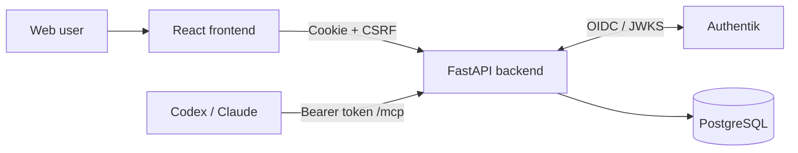

# Bitenary

Bitenary is a nutrition and meal-planning platform with a React
web application, a FastAPI backend, and a Streamable HTTP MCP server for Codex
and Claude.

## Features

- Authentik OIDC login and signup using Authorization Code with PKCE.
- Temporary guest AI chat with nutrition/recipe tools and Redis rate limits.
- Secure web cookies with CSRF protection and automatic access-token refresh.
- Personal MCP connections for Codex and Claude.
- One-time MCP token disclosure with HMAC-SHA-256 storage.
- Streamable HTTP MCP transport at `/mcp`.
- Read-only `get_server_status` MCP tool with usage auditing.
- React settings drawer and MCP connections management page.

## Architecture



| Component | Technology | Local address |
| --- | --- | --- |
| Frontend | React 19, TypeScript, Vite | `http://localhost:5173` |
| Backend | FastAPI, SQLAlchemy, Alembic | `http://localhost:8000` |
| Identity provider | Authentik | `http://localhost:9000` |
| Application database | PostgreSQL 16 | `localhost:5433` |
| MCP transport | FastMCP Streamable HTTP | `http://localhost:8000/mcp` |

## Repository layout

```text
Bitenary/
├── infrastructure/
│   ├── authentik/       # Local identity-provider stack
│   └── bitenary-db/     # Application PostgreSQL stack
├── readme/              # Detailed development and authentication guides
├── src/
│   ├── backend/         # FastAPI, web auth, MCP and migrations
│   └── frontend/        # React application and feature modules
└── README.md
```

## Prerequisites

- Git
- Docker Desktop or Docker Engine with Docker Compose
- Python 3.13, or another compatible Python 3 version
- Node.js and npm

Verify the local toolchain:

```powershell
git --version
docker version
docker compose version
python --version
node --version
npm --version
```

On Windows, use `npm.cmd` if PowerShell blocks the `npm.ps1` script.

## Quick start

### 1. Clone and configure

```powershell
git clone https://github.com/n0thing2c/Bitenary.git
cd Bitenary

Copy-Item infrastructure/authentik/.env.example infrastructure/authentik/.env
Copy-Item src/backend/.env.example src/backend/.env
Copy-Item src/frontend/.env.example src/frontend/.env
```

Set strong values for `PG_PASS` and `AUTHENTIK_SECRET_KEY` in
`infrastructure/authentik/.env`.

Generate secrets when needed:

```powershell
python -c "import secrets; print(secrets.token_urlsafe(48))"
```

Use separate generated values for `OIDC_STATE_SECRET`, `CSRF_SECRET`, and
`MCP_TOKEN_PEPPER` in `src/backend/.env`.

Guest chat defaults to 10 requests per minute and 50 requests per day for both
the guest identity and source IP. Override `GUEST_CHAT_RATE_LIMIT_PER_MINUTE`
and `GUEST_CHAT_RATE_LIMIT_PER_DAY` in `src/backend/.env` when needed.

### 2. Start infrastructure

```powershell
docker compose -f infrastructure/authentik/docker-compose.yml up -d
docker compose -f infrastructure/bitenary-db/docker-compose.yml up -d
```

Complete the Authentik initial setup at:

```text
http://localhost:9000/if/flow/initial-setup/
```

Then configure the Bitenary OIDC application and copy its client credentials
into `src/backend/.env`. Follow the
[web authentication guide](readme/web-authentication.md) for the exact
provider settings and redirect URI.

### 3. Start the backend

```powershell
cd src/backend
python -m venv venv
.\venv\Scripts\python.exe -m pip install -r requirements.txt
.\venv\Scripts\python.exe -m alembic -c alembic.ini upgrade head
.\venv\Scripts\python.exe -m uvicorn app.main:app --reload
```

### 4. Start the frontend

Open another terminal from the repository root:

```powershell
cd src/frontend
npm install
npm run dev
```

Open `http://localhost:5173`.

## Verify the installation

| Check | Address or command | Expected result |
| --- | --- | --- |
| Backend health | `http://localhost:8000/api/health` | JSON with `status: "ok"` |
| Authentik | `http://localhost:9000` | Authentik login page |
| Frontend | `http://localhost:5173` | Bitenary authentication page |
| MCP without token | Request `POST /mcp` | `401 Unauthorized` |

For an authenticated MCP smoke test, follow the
[MCP authentication guide](readme/mcp-authentication.md).

## Configure Bitenary MCP in Codex

Codex connects to Bitenary through the Streamable HTTP endpoint and sends the
personal token as a bearer token. Codex reads MCP servers from
`~/.codex/config.toml`; the CLI, desktop app, and IDE extension on the same host
share this configuration. See the
[official OpenAI MCP documentation](https://learn.chatgpt.com/docs/extend/mcp?surface=cli)
for the complete configuration reference.

### 1. Create a personal MCP connection

1. Sign in to Bitenary.
2. Open **Settings** from the avatar menu.
3. Select **MCP connections**, then create a Codex connection.
4. Copy the plaintext token immediately. It is displayed only once.

The examples below use the local server URL `http://localhost:8000/mcp`. Replace
it with the public backend URL when Codex and Bitenary run on different hosts.
The URL must be reachable from the machine running Codex.

### 2. Set the token on Windows

In PowerShell, replace `bty_mcp_xxx.your-secret` with the token copied from
Bitenary. The following command stores it for the current Windows user:

```powershell
[Environment]::SetEnvironmentVariable(
  "BITENARY_MCP_TOKEN",
  "bty_mcp_xxx.your-secret",
  "User"
)
```

Close and reopen Codex, VS Code, and terminal windows so they inherit the new
environment variable. Confirm that the variable exists without printing the
token:

```powershell
[bool][Environment]::GetEnvironmentVariable(
  "BITENARY_MCP_TOKEN",
  "User"
)
```

The command should return `True`.

### 3. Set the token on Linux

For the current shell session:

```bash
export BITENARY_MCP_TOKEN='bty_mcp_xxx.your-secret'
```

To make it available after a reboot, add the same `export` line to the startup
file for the shell that launches Codex, such as `~/.bashrc` or `~/.zshrc`, then
reload it. For Bash:

```bash
source ~/.bashrc
```

Confirm that the variable exists without printing the token:

```bash
test -n "$BITENARY_MCP_TOKEN" && echo "BITENARY_MCP_TOKEN is set"
```

### 4. Add the MCP server to Codex

Open the Codex configuration file:

- Windows: `%USERPROFILE%\.codex\config.toml`
- Linux: `~/.codex/config.toml`

Create the file if it does not exist, then add:

```toml
[mcp_servers.bitenary-local]
url = "http://localhost:8000/mcp"
bearer_token_env_var = "BITENARY_MCP_TOKEN"
```

Keep the token out of `config.toml`: `bearer_token_env_var` contains only the
environment-variable name. If Bitenary displayed a generated Codex snippet,
you may paste that snippet instead because it already contains the correct MCP
URL.

Restart Codex after saving the configuration. Then verify the connection:

```text
/mcp
```

The result should list `bitenary-local`, show `Auth: Bearer token`, and display
the available Bitenary tools. From the CLI, `codex mcp list` provides the same
server-level check. For a read-only smoke test, ask Codex:

```text
Use the get_server_status tool from the bitenary-local MCP server and return
the result unchanged.
```

The expected response includes `"status": "ok"` and
`"service": "bitenary-mcp"`. Do not use `add_to_fridge` or `save_meal_plan` for
a smoke test unless you intentionally want to modify application data.

## Development commands

Run backend tests from `src/backend`:

```powershell
.\venv\Scripts\python.exe -m pytest tests
```

Run frontend tests and create a production build from `src/frontend`:

```powershell
npm run test
npm run build
```

More backend commands and troubleshooting are documented in the
[backend development guide](readme/backend-development.md).

## Documentation

| Guide | Purpose |
| --- | --- |
| [Documentation index](readme/README.md) | Entry point for all detailed project guides |
| [Backend development](readme/backend-development.md) | Environment, migrations, server, tests and troubleshooting |
| [Backend Virtual Fridge](readme/backend-virtual-fridge.md) | Inventory CRUD, expiry notifications, migrations and testing |
| [Web authentication](readme/web-authentication.md) | Authentik OIDC setup, auth flow, cookies and endpoint verification |
| [MCP authentication](readme/mcp-authentication.md) | Personal tokens, client configuration, status-tool smoke test and auditing |

## Security notes

- Never commit `.env` files, OIDC client secrets, refresh tokens, or MCP bearer
  tokens.
- Use `COOKIE_SECURE=false` only for local HTTP development.
- Production deployments require HTTPS, `COOKIE_SECURE=true`, strong secrets,
  and a stable `MCP_TOKEN_PEPPER`.
- Changing `MCP_TOKEN_PEPPER` invalidates every existing MCP token.
- Plaintext MCP tokens are returned once and must not be written to logs or
  application storage.
