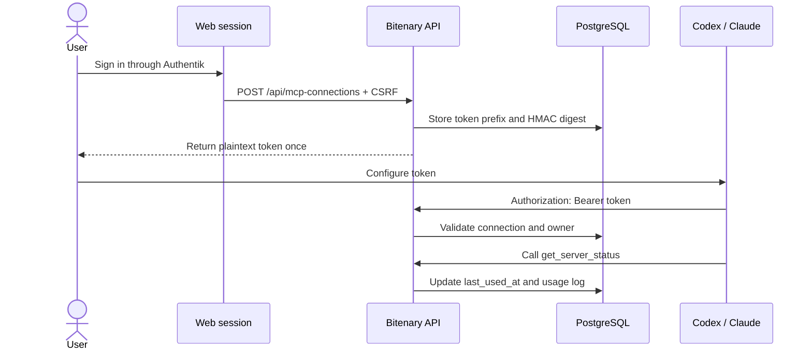

# MCP Personal Token Authentication

Bitenary exposes a stateless Streamable HTTP MCP server at `/mcp`. Codex and
Claude authenticate with user-owned personal bearer tokens created through the
web-authenticated connection API.

This phase uses pre-issued personal tokens, not MCP OAuth. Clients must be
configured with a token once; they do not open a browser-based OAuth login.

## Contents

- [Connection flow](#connection-flow)
- [Configuration](#configuration)
- [Connection API](#connection-api)
- [Token security](#token-security)
- [Client configuration](#client-configuration)
- [Status-tool smoke test](#status-tool-smoke-test)
- [Audit verification](#audit-verification)
- [Tests](#tests)
- [Troubleshooting](#troubleshooting)
- [Current limits](#current-limits)

## Connection flow



Authentik is used to create and manage connections through the web API. MCP
clients do not send Authentik cookies or call Authentik directly.

## Configuration

Required backend settings:

```env
BACKEND_PUBLIC_URL=http://localhost:8000
MCP_TOKEN_PEPPER=<strong-random-secret>
MCP_TOKEN_TTL_DAYS=30
```

`MCP_TOKEN_TTL_DAYS` is configurable from 1 to 3650 days. The application
fallback is 90 days when the variable is absent; the local `.env.example`
explicitly uses 30 days.

Changing `MCP_TOKEN_PEPPER` invalidates all existing MCP tokens.

Install dependencies and apply migrations:

```powershell
cd src/backend
.\venv\Scripts\python.exe -m pip install -r requirements.txt
.\venv\Scripts\python.exe -m alembic -c alembic.ini upgrade head
```

Start the backend:

```powershell
.\venv\Scripts\python.exe -m uvicorn app.main:app --host 127.0.0.1 --port 8000
```

## Connection API

| Method   | Endpoint                           | Purpose                                         | Protection      |
| -------- | ---------------------------------- | ----------------------------------------------- | --------------- |
| `POST`   | `/api/mcp-connections`             | Create a connection and disclose its token once | Web auth + CSRF |
| `GET`    | `/api/mcp-connections`             | List connections owned by the current user      | Web auth        |
| `DELETE` | `/api/mcp-connections/{client_id}` | Revoke an owned connection                      | Web auth + CSRF |

Create request:

```json
{
  "client_type": "CODEX",
  "display_name": "My local Codex"
}
```

`client_type` accepts `CODEX` or `CLAUDE`. `display_name` is trimmed and must
contain 1 to 100 characters.

The create response includes:

- Connection metadata and expiry.
- Shared MCP URL.
- Plaintext bearer token, returned once.
- `BITENARY_MCP_TOKEN` environment-variable name.
- Codex and Claude configuration snippets.

List responses never contain plaintext tokens or token digests. Deleting
another user's connection returns `404`.

## Token security

Token format:

```text
bty_mcp_<8-lowercase-hex>.<random-secret>
```

The database stores only:

- The lookup prefix.
- An HMAC-SHA-256 digest computed with `MCP_TOKEN_PEPPER`.
- Connection ownership, status, expiry, revocation and usage timestamps.

Missing, malformed, unknown, expired, revoked, disabled-client, and
disabled-user credentials all receive the same generic `401 Unauthorized`
response.

## Client configuration

### Codex

Set the token in the environment that launches Codex:

```powershell
$env:BITENARY_MCP_TOKEN = "bty_mcp_<lookup-prefix>.<secret>"
```

Add the server:

```powershell
codex mcp add bitenary `
    --url http://localhost:8000/mcp `
    --bearer-token-env-var BITENARY_MCP_TOKEN
```

Equivalent `config.toml`:

```toml
[mcp_servers.bitenary]
url = "http://localhost:8000/mcp"
bearer_token_env_var = "BITENARY_MCP_TOKEN"
```

Launch Codex from the same terminal so it inherits the environment variable.

### Claude Code

Set the token:

```powershell
$env:BITENARY_MCP_TOKEN = "bty_mcp_<lookup-prefix>.<secret>"
```

Add the server while preserving the environment reference:

```powershell
claude mcp add --transport http --scope local bitenary `
    http://localhost:8000/mcp `
    --header 'Authorization: Bearer ${BITENARY_MCP_TOKEN}'
```

## Status-tool smoke test

This deterministic smoke test does not require Codex, Claude, or the frontend.
It requires PostgreSQL, the backend, completed migrations, and an active
plaintext token.

In a second terminal:

```powershell
cd src/backend
$env:BITENARY_MCP_TOKEN = "bty_mcp_<lookup-prefix>.<secret>"

@'
import asyncio
import os

import httpx
from mcp import ClientSession
from mcp.client.streamable_http import streamable_http_client


async def main():
    token = os.environ["BITENARY_MCP_TOKEN"]
    async with httpx.AsyncClient(
        headers={"Authorization": f"Bearer {token}"}
    ) as http_client:
        async with streamable_http_client(
            "http://localhost:8000/mcp",
            http_client=http_client,
        ) as (read_stream, write_stream, _):
            async with ClientSession(read_stream, write_stream) as session:
                await session.initialize()
                tools = await session.list_tools()
                result = await session.call_tool("get_server_status", {})

                print("TOOLS:", [tool.name for tool in tools.tools])
                print("RESULT:", result.content[0].text)


asyncio.run(main())
'@ | .\venv\Scripts\python.exe -
```

Expected output:

```text
TOOLS: ['get_server_status']
RESULT: {"status":"ok","service":"bitenary-mcp"}
```

## Audit verification

A successful tool call:

- Updates `mcp_clients.last_used_at`.
- Creates a `mcp_usage_logs` row.
- Completes the row with `outcome = SUCCEEDED` and latency.

Audit rows never contain bearer tokens, tool arguments, results, prompts, or
health-profile payloads.

Example queries:

```sql
SELECT display_name, status, last_used_at, revoked_at
FROM mcp_clients
ORDER BY created_at DESC;

SELECT outcome, latency_ms, error_code, invoked_at
FROM mcp_usage_logs
ORDER BY invoked_at DESC;
```

## Tests

Run all MCP backend tests:

```powershell
cd src/backend
.\venv\Scripts\python.exe -m pytest `
    tests/test_mcp_tokens.py `
    tests/test_mcp_routes.py `
    tests/test_mcp_status_tool.py
```

Run the complete backend suite:

```powershell
.\venv\Scripts\python.exe -m pytest tests
```

## Troubleshooting

| Symptom                                  | Likely cause                                      | Check                                       |
| ---------------------------------------- | ------------------------------------------------- | ------------------------------------------- |
| `401 Unauthorized`                       | Invalid, expired, revoked, or disabled credential | Token value and connection/user status      |
| `500 Internal Server Error` on tool call | Audit table or tool seed unavailable              | Migration revision and `mcp_tools` seed     |
| `ModuleNotFoundError: mcp.server`        | Stale virtual environment                         | Reinstall `requirements.txt`                |
| Client cannot reach `/mcp`               | Backend URL, port, proxy, or host mismatch        | `BACKEND_PUBLIC_URL` and port `8000`        |
| Codex does not send the token            | Codex did not inherit the environment             | Launch Codex from the token-owning terminal |
| Tool succeeds but no audit row appears   | Migration or audit transaction failure            | Backend logs and `mcp_usage_logs`           |

## Related documentation

- [Documentation index](README.md)
- [Project overview](../README.md)
- [Backend development](backend-development.md)
- [Web authentication](web-authentication.md)
