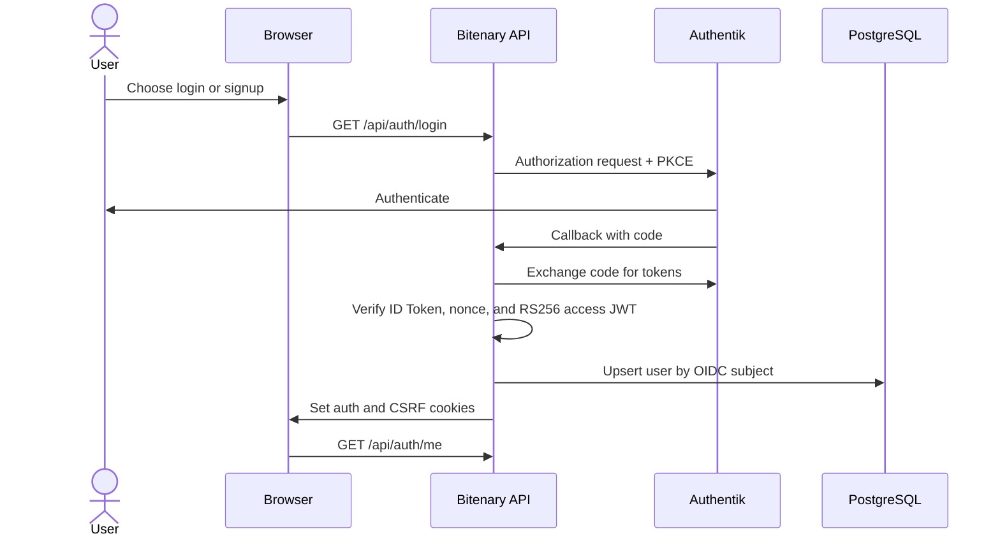

# Web Authentication

Bitenary authenticates web users through Authentik using OIDC Authorization
Code with PKCE. Authentik owns credentials and tokens; Bitenary verifies access
JWTs, stores a local user mapping, and manages browser cookies.

## Contents

- [Authentication flow](#authentication-flow)
- [Authentik setup](#authentik-setup)
- [Backend configuration](#backend-configuration)
- [Endpoints](#endpoints)
- [Cookie and CSRF policy](#cookie-and-csrf-policy)
- [Manual verification](#manual-verification)
- [Implementation map](#implementation-map)
- [Security and current limits](#security-and-current-limits)

## Authentication flow



Bitenary does not issue a separate web JWT and does not persist server-side web
sessions.

## Authentik setup

### 1. Configure the local stack

From the repository root:

```powershell
Copy-Item infrastructure/authentik/.env.example infrastructure/authentik/.env
```

Set strong values:

```env
PG_PASS=<strong-database-password>
AUTHENTIK_SECRET_KEY=<strong-random-secret>
AUTHENTIK_ERROR_REPORTING__ENABLED=false
```

Start Authentik:

```powershell
docker compose -f infrastructure/authentik/docker-compose.yml up -d
```

Open `http://localhost:9000/if/flow/initial-setup/` and create the initial
`akadmin` password.

### 2. Create the OIDC application

In the Authentik Admin interface, create an application and OAuth2/OIDC
provider with:

| Setting | Value |
| --- | --- |
| Application name | `Bitenary` |
| Application slug | `bitenary` |
| Provider type | OAuth2/OIDC |
| Client type | Confidential |
| Grant type | Authorization Code |
| Scopes | `openid profile email offline_access` |
| Signing key | Default asymmetric key |
| Signing algorithm | RS256 |

Register this strict authorization redirect URI on the provider:

| URI type | URI |
| --- | --- |
| Authorization | `http://localhost:8000/api/auth/callback` |

### 3. Configure signup enrollment

Create a dedicated enrollment flow for local Bitenary users. Do not use
`default-source-enrollment-flow` or any `default-source-*` stage: those objects
are intended for users arriving from external identity sources such as Google,
GitHub, LDAP, or SAML.

#### Create the prompt fields

Navigate to **Flows and Stages > Prompt fields** and create these four fields:

| Name | Field key | Type | Required | Order |
| --- | --- | --- | --- | --- |
| `bitenary-enrollment-username` | `username` | Username | Yes | 0 |
| `bitenary-enrollment-email` | `email` | Email | Yes | 10 |
| `bitenary-enrollment-password` | `password` | Password | Yes | 20 |
| `bitenary-enrollment-password-repeat` | `password_repeat` | Password | Yes | 30 |

Use the labels `Username`, `Email`, `Password`, and `Confirm password`.
Authentik requires password fields in the same Prompt stage to contain matching
values. The `password` field is the value that the later User Write stage stores
for the new user.

Existing prompt fields can be reused if their field keys and types match this
table exactly. Bitenary-specific fields are recommended because changing their
labels or validation later will not affect Authentik's initial-setup or user-
settings flows.

#### Create the enrollment stages

Navigate to **Flows and Stages > Stages** and create the following stages.

Create a **Prompt Stage** with:

| Setting | Value |
| --- | --- |
| Name | `bitenary-enrollment-prompt` |
| Fields | The four Bitenary prompt fields, in the order shown above |
| Validation policies | None for the initial local setup |

The password is collected by Password-type fields in this Prompt stage. Do not
add a Password Stage to the enrollment flow; a Password Stage authenticates an
existing user rather than defining a new user's password.

Create a **User Write Stage** with:

| Setting | Value |
| --- | --- |
| Name | `bitenary-enrollment-write` |
| User creation mode | Always |
| User type | Internal |
| Create users as inactive | Off |
| Create users group | Empty |
| User path template | Empty |

Finally, create a **User Login Stage** named
`bitenary-enrollment-login` and keep its remaining settings at their defaults.
This stage signs in the user immediately after the account is created.

#### Create and bind the enrollment flow

Navigate to **Flows and Stages > Flows** and create a flow with:

| Setting | Value |
| --- | --- |
| Name | `Bitenary Enrollment` |
| Title | `Bitenary Enrollment` |
| Slug | `bitenary-enrollment` |
| Designation | Enrollment |
| Authentication | Require unauthenticated |
| Policy engine mode | Any |

Open the flow's **Stage Bindings** tab and bind only these stages:

| Order | Stage |
| --- | --- |
| 0 | `bitenary-enrollment-prompt` |
| 10 | `bitenary-enrollment-write` |
| 20 | `bitenary-enrollment-login` |

Leave the flow's **Policy / Group / User Bindings** tab empty for the initial
local setup. Also leave every stage binding free of source-enrollment or SSO
policies. In particular, do not bind `default-source-enrollment-if-sso`.

#### Add signup to the login flow

Navigate to **Flows and Stages > Flows**, open the authentication flow used by
the Bitenary provider (normally `default-authentication-flow`), and select its
**Stage Bindings** tab.

Find `default-authentication-identification`, click **Edit Stage** (not
**Edit Binding**), select `Bitenary Enrollment` in the **Enrollment flow**
field, and save. This makes Authentik display an enrollment link from its login
screen while preserving the current OIDC authorization request.

Navigate to **Applications > Providers**, edit the Bitenary OAuth2/OIDC
provider, and confirm that its **Authentication flow** is the same flow edited
above. Do not change the existing password, MFA validation, or user login stage
bindings in that authentication flow.

The Bitenary frontend can now reach the enrollment flow in either of two ways:

```text
Sign up on Bitenary
  -> GET /api/auth/signup
  -> /if/flow/bitenary-enrollment/

Log in on Bitenary
  -> Authentik authentication flow
  -> Sign up link on the identification screen
  -> /if/flow/bitenary-enrollment/
```

Record the enrollment slug for the backend configuration:

```env
AUTHENTIK_ENROLLMENT_URL=http://localhost:9000/if/flow/bitenary-enrollment/
```

Restart the Bitenary backend after changing its `.env`. Test enrollment in a
private browser window so that an existing Authentik session cannot interfere
with the flow. A successful form contains Username, Email, Password, and
Confirm password, creates an Internal user, signs that user in, and then resumes
the Bitenary OIDC flow.

### 4. Configure full SSO logout

Bitenary first revokes its refresh token and clears its cookies, then navigates
the browser to Authentik's application-specific end-session endpoint. Configure
a dedicated invalidation flow so that this request also ends the main Authentik
SSO session and returns the browser to Bitenary.

#### Create the logout stages

In the Authentik Admin interface, navigate to **Flows and Stages > Stages**:

1. Reuse an existing **User Logout** stage, or create one if none exists.
2. Create a **Redirect** stage with:

   | Setting | Value |
   | --- | --- |
   | Name | `bitenary-logout-redirect` |
   | Mode | Static |
   | Static target | `http://localhost:5173/` |
   | Keep flow context | Off |

The User Logout stage terminates the Authentik browser session. The Redirect
stage controls where the browser goes after logout; it is separate from the
OAuth provider's redirect URI list.

#### Create and bind the invalidation flow

Navigate to **Flows and Stages > Flows** and create a flow with:

| Setting | Value |
| --- | --- |
| Name | `Bitenary invalidation` |
| Slug | `bitenary-invalidation` |
| Designation | Invalidation |

Open the new flow's **Stage Bindings** tab and bind the stages in this order:

| Order | Stage |
| --- | --- |
| 10 | User Logout |
| 20 | `bitenary-logout-redirect` |

User Logout must run before Redirect; otherwise the browser can return to
Bitenary while the Authentik SSO session is still active.

Finally, navigate to **Applications > Providers**, edit the Bitenary OAuth2/OIDC
provider, select `Bitenary invalidation` as its **Invalidation flow**, and save
the provider.

For this Bitenary implementation:

- A provider **Post Logout** redirect URI is not required. An existing entry may
  remain, but Bitenary does not send `post_logout_redirect_uri` because Authentik
  requires a matching `id_token_hint` with it.
- Leave the provider's **Logout URI** empty. That field is for front-channel or
  back-channel notifications to an RP endpoint, which Bitenary does not expose.
- Use the Redirect stage's static target to return to Bitenary. Replace the local
  URL with the deployed frontend origin in non-local environments.

The resulting logout sequence is:

```text
POST /api/auth/logout
  -> clear Bitenary cookies
GET /api/auth/end-session
  -> Authentik application end-session
  -> User Logout stage ends the Authentik SSO session
  -> Redirect stage returns to the Bitenary frontend
```

Verify provider discovery:

```text
http://localhost:9000/application/o/bitenary/.well-known/openid-configuration
```

## Backend configuration

Copy the backend template:

```powershell
Copy-Item src/backend/.env.example src/backend/.env
```

Set the Authentik values:

```env
AUTHENTIK_CLIENT_ID=<provider-client-id>
AUTHENTIK_CLIENT_SECRET=<provider-client-secret>
AUTHENTIK_ISSUER=http://localhost:9000/application/o/bitenary/
AUTHENTIK_AUTHORIZE_URL=http://localhost:9000/application/o/authorize/
AUTHENTIK_ENROLLMENT_URL=http://localhost:9000/if/flow/<enrollment-flow-slug>/
AUTHENTIK_TOKEN_URL=http://localhost:9000/application/o/token/
AUTHENTIK_USERINFO_URL=http://localhost:9000/application/o/userinfo/
AUTHENTIK_REVOKE_URL=http://localhost:9000/application/o/revoke/
AUTHENTIK_JWKS_URL=http://localhost:9000/application/o/bitenary/jwks/
AUTHENTIK_END_SESSION_URL=http://localhost:9000/application/o/bitenary/end-session/
OIDC_REDIRECT_URI=http://localhost:8000/api/auth/callback
OIDC_SCOPE=openid profile email offline_access
OIDC_STATE_SECRET=<strong-random-secret>
CSRF_SECRET=<strong-random-secret>
```

For local HTTP:

```env
FRONTEND_ORIGINS=http://localhost:5173
BACKEND_PUBLIC_URL=http://localhost:8000
COOKIE_SECURE=false
COOKIE_SAMESITE=lax
```

## Endpoints

| Method | Endpoint | Purpose | Protection |
| --- | --- | --- | --- |
| `GET` | `/api/auth/login` | Start OIDC login | Public |
| `GET` | `/api/auth/signup` | Start enrollment flow | Public |
| `GET` | `/api/auth/callback` | Complete authorization-code exchange | Signed state + PKCE |
| `GET` | `/api/auth/me` | Return the current user | Access cookie |
| `POST` | `/api/auth/refresh` | Rotate Authentik tokens | Refresh cookie + CSRF |
| `POST` | `/api/auth/logout` | Revoke and clear tokens | CSRF |
| `GET` | `/api/auth/end-session` | Redirect the browser through Authentik logout | Public navigation |
| `GET` | `/api/auth/csrf` | Issue or reuse a CSRF token | Public |

`login` and `signup` accept an optional validated `return_to` path.

## Cookie and CSRF policy

| Cookie | Contents | HttpOnly | Path |
| --- | --- | --- | --- |
| `bitenary_access` | Authentik access JWT | Yes | `/api` |
| `bitenary_refresh` | Authentik refresh token | Yes | `/api/auth` |
| `bitenary_csrf` | Signed double-submit CSRF token | No | `/` |

State-changing requests send the CSRF cookie value again in:

```http
X-CSRF-Token: <bitenary_csrf value>
```

The CSRF value is an opaque `v1.<nonce>.<signature>` token authenticated with
HMAC-SHA256 and `CSRF_SECRET`. The backend accepts it only when the cookie and
header match in constant time and the signature is valid. Legacy unsigned or
tampered cookies are replaced the next time `GET /api/auth/csrf` is called.

All unsafe methods under `/api` are protected centrally. `GET`, `HEAD`,
`OPTIONS`, and `TRACE` are exempt; the bearer-authenticated `/mcp` endpoint is
outside this middleware scope. This signed-nonce design prevents attackers from
inventing an injectable CSRF value, but it is not bound to an individual access
or refresh session.

## Manual verification

Start Authentik, PostgreSQL, the backend, and the frontend. Then:

1. Open `http://localhost:5173`.
2. Choose **Log in** or **Sign up**.
3. Complete authentication in Authentik.
4. Confirm the browser returns to the frontend.
5. Confirm `GET http://localhost:8000/api/auth/me` succeeds with credentials.
6. Log out and confirm the auth cookies are cleared and the browser passes
   through the Authentik end-session flow.
7. Choose Log in again and confirm Authentik requires authentication instead of
   silently reusing the previous SSO session.

The backend login flow can also be started directly:

```text
http://localhost:8000/api/auth/login?return_to=/
```

## Implementation map

| Area | Main files |
| --- | --- |
| Domain | `identity/domain/entities.py`, `identity/domain/errors.py` |
| User persistence | `identity/repository/users.py`, `identity/infrastructure/sqlalchemy_users.py` |
| OIDC transaction | `identity/service/oidc_transaction.py` |
| Authentik client | `identity/infrastructure/authentik_client.py` |
| JWT verification | `identity/infrastructure/jwt_verifier.py` |
| Auth orchestration | `identity/service/auth_service.py`, `identity/service/current_user.py` |
| HTTP delivery | `identity/delivery/routes.py`, `identity/delivery/cookies.py` |
| Dependency wiring | `identity/wiring.py` |
| Database migration | `alembic/versions/202607200002_create_users.py` |

## Security and current limits

- Production requires HTTPS and `COOKIE_SECURE=true`.
- OIDC ID Tokens and access JWTs are accepted only after issuer, audience,
  signature, expiry, nonce, and subject consistency are validated. UserInfo is
  used only when its subject exactly matches the ID Token subject.
- OIDC state is signed and bound to the PKCE verifier and nonce.
- Every unsafe REST API method requires a valid signed CSRF token.
- Signup depends on a correctly configured Authentik enrollment flow.
- Full SSO logout depends on the Bitenary provider using an invalidation flow
  with User Logout followed by the frontend Redirect stage.
- This guide covers web-user authentication. MCP clients use separate personal
  bearer tokens described in the [MCP authentication guide](mcp-authentication.md).

## Related documentation

- [Documentation index](README.md)
- [Project overview](../README.md)
- [Backend development](backend-development.md)
- [MCP authentication](mcp-authentication.md)
