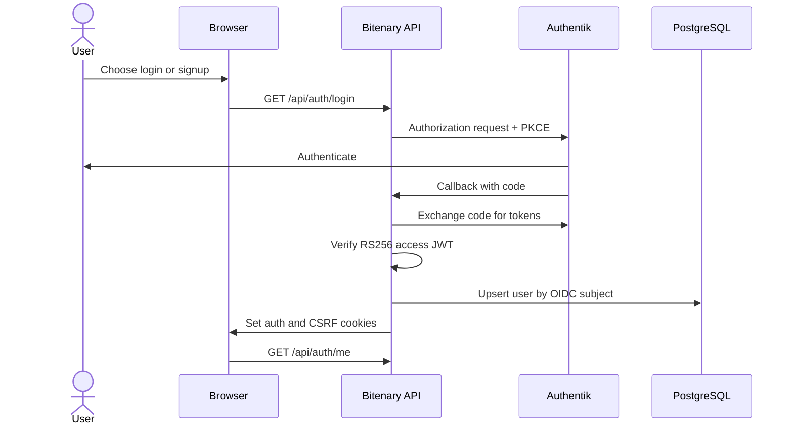

# Web Authentication

Bitenary authenticates web users through Authentik using OIDC Authorization
Code with PKCE. Authentik owns credentials and tokens; Bitenary verifies access
JWTs, stores a local user mapping, and manages browser cookies.

## Contents

- [Authentication flow](#authentication-flow)
- [Authentik setup](#authentik-setup)
- [Backend configuration](#backend-configuration)
- [Endpoints](#endpoints)
- [Cookie and CSRF policy](#cookie-and-csrf-policy)
- [Manual verification](#manual-verification)
- [Implementation map](#implementation-map)
- [Security and current limits](#security-and-current-limits)

## Authentication flow



Bitenary does not issue a separate web JWT and does not persist server-side web
sessions.

## Authentik setup

### 1. Configure the local stack

From the repository root:

```powershell
Copy-Item infrastructure/authentik/.env.example infrastructure/authentik/.env
```

Set strong values:

```env
PG_PASS=<strong-database-password>
AUTHENTIK_SECRET_KEY=<strong-random-secret>
AUTHENTIK_ERROR_REPORTING__ENABLED=false
```

Start Authentik:

```powershell
docker compose -f infrastructure/authentik/docker-compose.yml up -d
```

Open `http://localhost:9000/if/flow/initial-setup/` and create the initial
`akadmin` password.

### 2. Create the OIDC application

In the Authentik Admin interface, create an application and OAuth2/OIDC
provider with:

| Setting | Value |
| --- | --- |
| Application name | `Bitenary` |
| Application slug | `bitenary` |
| Provider type | OAuth2/OIDC |
| Client type | Confidential |
| Grant type | Authorization Code |
| Scopes | `openid profile email offline_access` |
| Signing key | Default asymmetric key |
| Signing algorithm | RS256 |

Register this strict redirect URI:

```text
http://localhost:8000/api/auth/callback
```

For signup, attach an enrollment flow to the authentication identification
stage and record its flow slug.

Verify provider discovery:

```text
http://localhost:9000/application/o/bitenary/.well-known/openid-configuration
```

## Backend configuration

Copy the backend template:

```powershell
Copy-Item src/backend/.env.example src/backend/.env
```

Set the Authentik values:

```env
AUTHENTIK_CLIENT_ID=<provider-client-id>
AUTHENTIK_CLIENT_SECRET=<provider-client-secret>
AUTHENTIK_ISSUER=http://localhost:9000/application/o/bitenary/
AUTHENTIK_AUTHORIZE_URL=http://localhost:9000/application/o/authorize/
AUTHENTIK_ENROLLMENT_URL=http://localhost:9000/if/flow/<enrollment-flow-slug>/
AUTHENTIK_TOKEN_URL=http://localhost:9000/application/o/token/
AUTHENTIK_USERINFO_URL=http://localhost:9000/application/o/userinfo/
AUTHENTIK_REVOKE_URL=http://localhost:9000/application/o/revoke/
AUTHENTIK_JWKS_URL=http://localhost:9000/application/o/bitenary/jwks/
AUTHENTIK_END_SESSION_URL=http://localhost:9000/application/o/bitenary/end-session/
OIDC_REDIRECT_URI=http://localhost:8000/api/auth/callback
OIDC_SCOPE=openid profile email offline_access
OIDC_STATE_SECRET=<strong-random-secret>
CSRF_SECRET=<strong-random-secret>
```

For local HTTP:

```env
FRONTEND_ORIGINS=http://localhost:5173
BACKEND_PUBLIC_URL=http://localhost:8000
COOKIE_SECURE=false
COOKIE_SAMESITE=lax
```

## Endpoints

| Method | Endpoint | Purpose | Protection |
| --- | --- | --- | --- |
| `GET` | `/api/auth/login` | Start OIDC login | Public |
| `GET` | `/api/auth/signup` | Start enrollment flow | Public |
| `GET` | `/api/auth/callback` | Complete authorization-code exchange | Signed state + PKCE |
| `GET` | `/api/auth/me` | Return the current user | Access cookie |
| `POST` | `/api/auth/refresh` | Rotate Authentik tokens | Refresh cookie + CSRF |
| `POST` | `/api/auth/logout` | Revoke and clear tokens | CSRF |
| `GET` | `/api/auth/csrf` | Issue or reuse a CSRF token | Public |

`login` and `signup` accept an optional validated `return_to` path.

## Cookie and CSRF policy

| Cookie | Contents | HttpOnly | Path |
| --- | --- | --- | --- |
| `bitenary_access` | Authentik access JWT | Yes | `/api` |
| `bitenary_refresh` | Authentik refresh token | Yes | `/api/auth` |
| `bitenary_csrf` | Signed double-submit CSRF token | No | `/` |

State-changing requests send the CSRF cookie value again in:

```http
X-CSRF-Token: <bitenary_csrf value>
```

The CSRF value is an opaque `v1.<nonce>.<signature>` token authenticated with
HMAC-SHA256 and `CSRF_SECRET`. The backend accepts it only when the cookie and
header match in constant time and the signature is valid. Legacy unsigned or
tampered cookies are replaced the next time `GET /api/auth/csrf` is called.

All unsafe methods under `/api` are protected centrally. `GET`, `HEAD`,
`OPTIONS`, and `TRACE` are exempt; the bearer-authenticated `/mcp` endpoint is
outside this middleware scope. This signed-nonce design prevents attackers from
inventing an injectable CSRF value, but it is not bound to an individual access
or refresh session.

## Manual verification

Start Authentik, PostgreSQL, the backend, and the frontend. Then:

1. Open `http://localhost:5173`.
2. Choose **Log in** or **Sign up**.
3. Complete authentication in Authentik.
4. Confirm the browser returns to the frontend.
5. Confirm `GET http://localhost:8000/api/auth/me` succeeds with credentials.
6. Log out and confirm the auth cookies are cleared.

The backend login flow can also be started directly:

```text
http://localhost:8000/api/auth/login?return_to=/
```

## Implementation map

| Area | Main files |
| --- | --- |
| Domain | `identity/domain/entities.py`, `identity/domain/errors.py` |
| User persistence | `identity/repository/users.py`, `identity/infrastructure/sqlalchemy_users.py` |
| OIDC transaction | `identity/service/oidc_transaction.py` |
| Authentik client | `identity/infrastructure/authentik_client.py` |
| JWT verification | `identity/infrastructure/jwt_verifier.py` |
| Auth orchestration | `identity/service/auth_service.py`, `identity/service/current_user.py` |
| HTTP delivery | `identity/delivery/routes.py`, `identity/delivery/cookies.py` |
| Dependency wiring | `identity/wiring.py` |
| Database migration | `alembic/versions/202607200002_create_users.py` |

## Security and current limits

- Production requires HTTPS and `COOKIE_SECURE=true`.
- OIDC access JWTs are accepted only after issuer, audience, signature, expiry,
  and required claims are validated.
- OIDC state is signed and bound to the PKCE verifier and nonce.
- Every unsafe REST API method requires a valid signed CSRF token.
- Signup depends on a correctly configured Authentik enrollment flow.
- This guide covers web-user authentication. MCP clients use separate personal
  bearer tokens described in the [MCP authentication guide](mcp-authentication.md).

## Related documentation

- [Documentation index](README.md)
- [Project overview](../README.md)
- [Backend development](backend-development.md)
- [MCP authentication](mcp-authentication.md)
